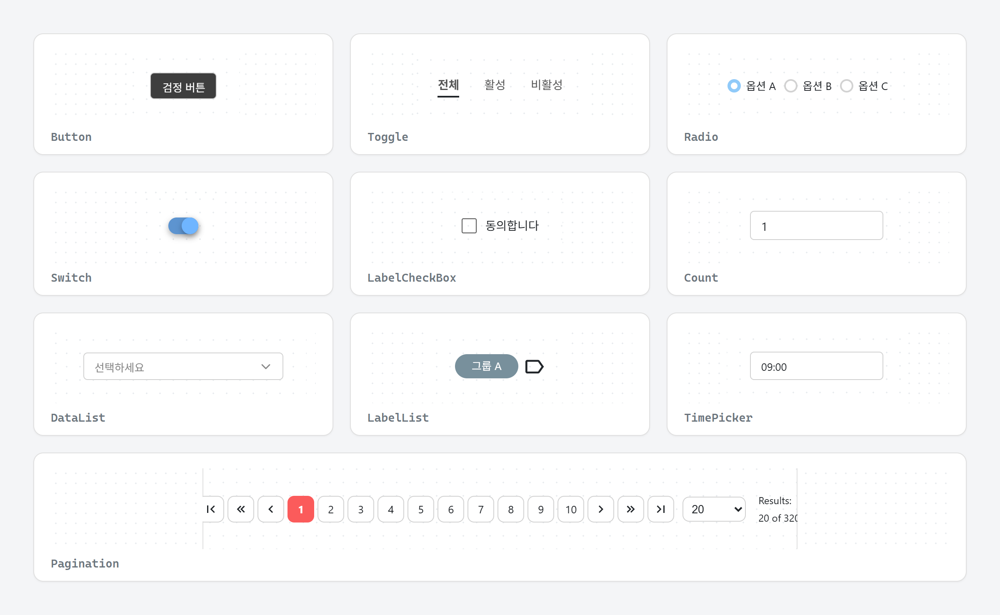
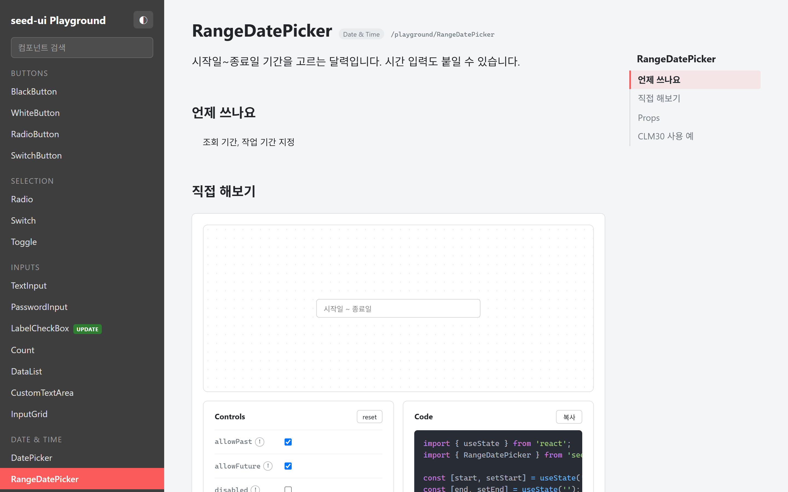
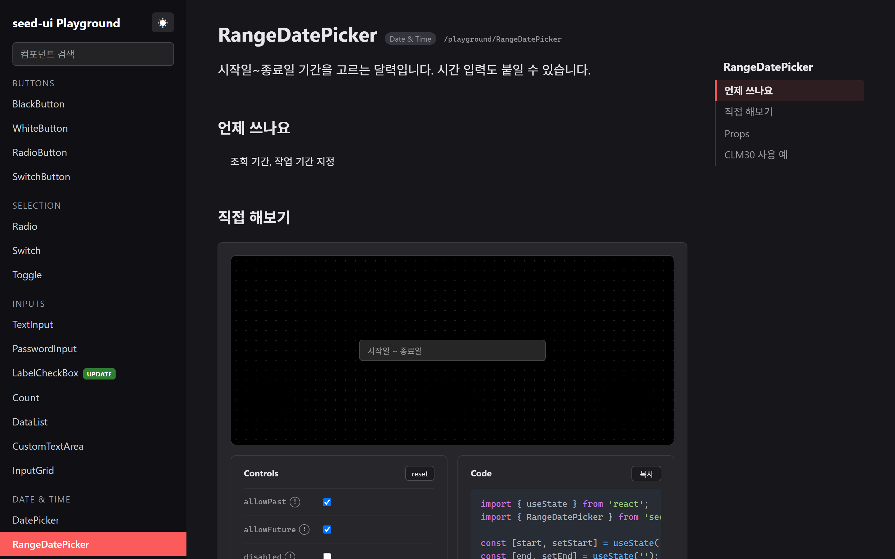
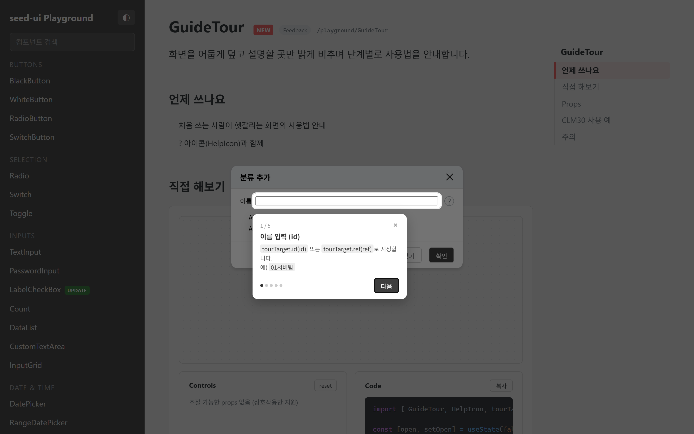
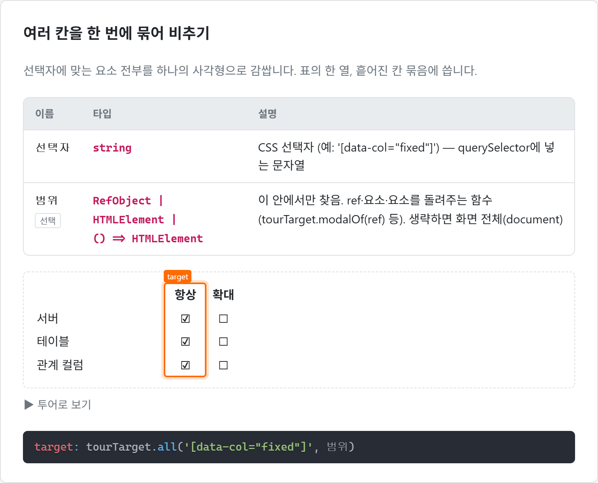
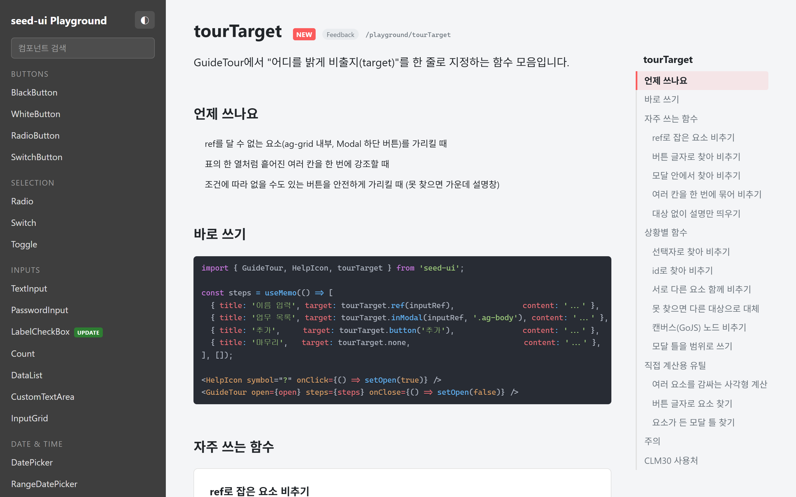

<div align="center">

# 🌱 seed-ui

**업무용 웹 화면을 빠르게 만드는 React 컴포넌트 라이브러리**

메뉴·라우트 자동 생성부터 입력·날짜·모달·알림·가이드 투어까지, 관리 화면에 늘 필요한 것들을 한 번에.

[](https://www.npmjs.com/package/seed-ui)




</div>

---

## ✨ 특징

- **바로 쓰는 업무 컴포넌트** — 버튼·입력·날짜·모달·페이지네이션 등 30여 개
- **메뉴 데이터 하나로 헤더·사이드 메뉴·라우트까지** — `HeaderCreator` · `AsideCreator` · `SetRoute`
- **다크모드 기본 지원** — `<html data-theme="dark">` 하나로 전체 전환
- **가이드 투어** — 화면 사용법을 단계별로 비춰 주는 `GuideTour` + `tourTarget` <sup>NEW</sup>
- **알림·확인창** — `await CLM.confirm(...)` 한 줄로 확인 받기
- **플레이그라운드 문서** — 모든 컴포넌트를 직접 조작해 보고 코드 복사

## 📦 설치

```bash
npm install seed-ui
# 또는
yarn add seed-ui
```

필요한 peer dependency

| 패키지 | 버전 |
| --- | --- |
| `react` / `react-dom` | ^19 |
| `react-router-dom` | ^7 |
| `@emotion/react` / `@emotion/styled` | ^11.14 |
| `zustand` | ^5 |
| `react-icons` | ^5 |
| `lodash` | ^4.17 |

## 🚀 빠른 시작

```jsx
import { useState } from 'react';
import { BlackButton, WhiteButton, TextInput, Modal, ToastNotify, CLM } from 'seed-ui';

export default function App() {
  const [open, setOpen] = useState(false);

  const save = async () => {
    if (!(await CLM.confirm({ title: '저장', message: '저장할까요?' }))) return;
    CLM.alertSuccess('저장되었습니다.');
    setOpen(false);
  };

  return (
    <>
      <BlackButton onClick={() => setOpen(true)}>새 항목</BlackButton>

      {open && (
        <Modal modalTitle="항목 추가" handleClose={() => setOpen(false)} callback={save}>
          <TextInput placeholder="이름" />
        </Modal>
      )}

      {/* 알림·확인창 렌더러: 앱 최상단에 한 번만 */}
      <ToastNotify />
    </>
  );
}
```

### 🌙 다크모드

seed-ui를 import하면 테마 변수가 자동으로 들어갑니다. `html`에 속성만 바꾸면 됩니다.

```js
document.documentElement.setAttribute('data-theme', 'dark'); // 'light' 로 되돌림
```

<table>
  <tr>
    <td></td>
    <td></td>
  </tr>
  <tr>
    <td align="center">Light</td>
    <td align="center">Dark</td>
  </tr>
</table>

## 🧭 가이드 투어 <sup>NEW</sup>

화면을 어둡게 덮고 설명할 곳만 밝게 비추며 단계별로 사용법을 안내합니다.
`?` 아이콘(`HelpIcon`)과 함께 쓰면 "사용법 보기" 버튼이 됩니다.



```jsx
import { GuideTour, HelpIcon, tourTarget } from 'seed-ui';

const steps = useMemo(() => [
  { title: '이름 입력', target: tourTarget.ref(inputRef),                 content: '공백 없이 입력합니다.' },
  { title: '업무 목록', target: tourTarget.inModal(inputRef, '.ag-body'), content: '업무를 고릅니다.' },
  { title: '추가',     target: tourTarget.button('추가'),                content: '바로 반영됩니다.' },
], []);

<HelpIcon symbol="?" onClick={() => setOpen(true)} />
<GuideTour open={open} steps={steps} onClose={() => setOpen(false)} />
```

`tourTarget`은 "어디를 비출지"를 한 줄로 지정하는 함수 모음입니다.
ref를 달 수 없는 ag-grid 내부, 모달 하단 버튼, 표의 한 열, GoJS 캔버스 노드까지 가리킬 수 있습니다.

| 함수 | 하는 일 |
| --- | --- |
| `tourTarget.ref(ref)` | ref로 잡은 요소 |
| `tourTarget.button(글자, 범위?)` | 버튼 글자로 찾기 |
| `tourTarget.inModal(ref, 선택자)` | ref가 든 모달 안에서 찾기 |
| `tourTarget.all(선택자, 범위?)` | 여러 칸을 한 번에 묶어 비추기 |
| `tourTarget.union(...)` / `first(...)` | 함께 비추기 / 없으면 다음 후보 |
| `tourTarget.diagramPart(getDiagram, getPart)` | GoJS 등 캔버스 노드 |
| `tourTarget.none` | 대상 없이 가운데 설명창 |



## 🧩 컴포넌트

| 분류 | 컴포넌트 |
| --- | --- |
| **Buttons** | `BlackButton` · `WhiteButton` · `RadioButton` · `SwitchButton` |
| **Selection** | `Radio` · `Switch` · `Toggle` |
| **Inputs** | `TextInput` · `PasswordInput` · `LabelCheckBox` <sup>UPDATE</sup> · `Count` · `DataList` · `CustomTextArea` · `InputGrid` |
| **Date & Time** | `DatePicker` · `RangeDatePicker` · `TimePicker` |
| **Feedback** | `Tooltip` · `HelpIcon` <sup>UPDATE</sup> · `GuideTour` <sup>NEW</sup> · `Modal` · `ToastNotify` (`CLM.alert*` / `CLM.confirm`) |
| **Navigation** | `Pagination` · `SideTabs` (`selectSideTab`) |
| **Layout** | `Accordion` · `DividingLine` · `Card` · `OptionCard` |
| **Data** | `Counter` · `CountList` · `LabelList` |
| **Menu** | `HeaderCreator` · `AsideCreator` · `SetRoute` |
| **Utility** | `DNDWrapper` · `Slider` · `EscStack` · `tourTarget` <sup>NEW</sup> |

### 메뉴 데이터 하나로 헤더 · 사이드 메뉴 · 라우트

```jsx
import { HeaderCreator, AsideCreator, SetRoute } from 'seed-ui';

const menuList = [
  { title: '대시보드', link: '/dashboard', component: <Dashboard /> },
  {
    title: '관리',
    link: '/manage',
    subMenu: [
      { title: '사용자', link: '/manage/user', component: <UserList />, menuRole: 1 },
      { title: '설정', link: '/manage/setting', component: <Setting />, isPublic: true },
    ],
  },
];

<HeaderCreator menuList={menuList} role="n" logoSetting={{ logo: <Logo />, logoLink: '/' }} />

<Routes>
  <Route path="/" element={<Layout />}>
    {SetRoute(menuList, role)} {/* 권한(menuRole·isPublic)에 맞춰 중첩 Route 자동 생성 */}
  </Route>
</Routes>
```

## 📖 플레이그라운드

모든 컴포넌트를 직접 조작해 보고, Props 표와 코드를 확인·복사할 수 있습니다.



```bash
git clone https://github.com/arkhyeon/seed-ui.git
cd seed-ui
npm install
npm run dev
# → http://localhost:5173/playground
```

- 왼쪽: 컴포넌트 목록과 검색 (새 기능에는 `NEW` / `UPDATE` 표시)
- 가운데: 설명 → 언제 쓰나요 → 직접 해보기(Controls · Code) → Props → 사용 예
- 오른쪽: 따라다니는 목차

## 🛠 개발

| 명령 | 설명 |
| --- | --- |
| `npm run dev` | 플레이그라운드 개발 서버 |
| `npm run preview` | 빌드 결과 미리보기 |
| `npm run build` | 라이브러리 빌드 **+ npm 배포** ⚠️ 배포까지 실행됩니다 |

## 📚 이전 문서

0.2 이전 버전의 상세 옵션 문서는 [docs/README.legacy.md](./docs/README.legacy.md)에 있습니다.
