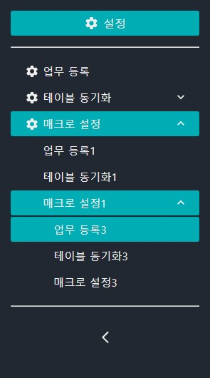
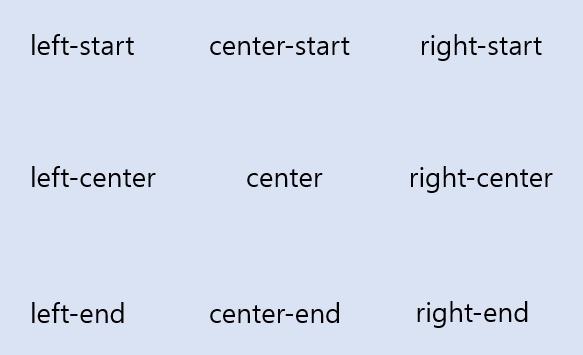

# seed-ui

웹 브라우저(chrome, Edge 등)를 사용하여 보시면 정리된 MD 문서 형식으로 보실 수 있습니다.

---

- [seed-ui](#seed-ui)
  - [[1] 소개](#1)
  - [[2] 설치 및 의존성](#2-설치-및-의존성)
  - [[3] Layout](#3-layout)
    - [[3-1] 메뉴 객체 생성](#3-1-메뉴-객체-생성)
    - [[3-2] Route 생성](#3-2-route-생성)
    - [[3-3] 헤더 생성](#3-3-헤더-생성)
    - [[3-4] 사이드 메뉴 생성](#3-4-사이드-메뉴-생성)
  - [[4] DataList](#4-datalist)
  - [[5] Pagination](#5-pagination)
  - [[6] button](#6-button)
  - [[7] tooltip](#7-tooltip)
  - [[8] modal](#8-modal)
  - [[9] alarm](#9-alarm)
  - [[10] slider](#10-slider)
  - [[11] datePicker](#11-datePicker)
  - [[12] dateBetweenPicker](#12-dateBetweenPicker)
  - [[13] dateTimePicker](#13-dateTimePicker)
  - [[14] dateTimeBetweenPicker](#14-dateTimeBetweenPicker)
  - [[15] timePicker](#15-timePicker)
  - [[16] radio](#16-radio)
  - [[17] switch](#17-switch)
  - [[18] toggle](#18-toggle)
  - [[19] inputGrid](#19-inputGrid)
    - [[19-1] 그리드 내용 배열 생성](#19-1-그리드-내용-배열-생성)
    - [[19-2] InputGrid 생성](#19-1-InputGrid-생성)
  - [[20] groupList](#20-groupList)
  - [[21] labelList](#21-labelList)
  - [[22] uniqueLabelList](#22-uniqueLabelList)
  - [[23] count](#23-count)
  - [[24] countList](#24-countList)

## 1. <a name='1'></a>[1] 소개

웹사이트 제작에 공통적으로 필요한 템플릿 및 컴포넌트들을 제공하여 빠른 UI 구축할 수 있는 라이브러리 입니다.

## 2. <a name='2-설치-및-의존성'></a>[2] 설치 및 의존성

> npm install seed-ui  
> yarn add seed-ui

| Dependency       | Version | Dependency      | Version |
| ---------------- | ------- | --------------- | ------- |
| react            | 18.2.0  | @emotion/react  | 11.9.3  |
| react-router-dom | 6.3.0   | @emotion/styled | 11.9.3  |

## 3. <a name='3-layout'></a>[3] Layout

### 3.1. <a name='3-1-메뉴-객체-생성'></a>[3-1] 메뉴 객체 생성

원하는 옵션으로 메뉴 객체를 생성합니다.  
해당 객체는 헤더와 사이드 메뉴 그리고 라우터를 생성할 때 필요합니다.

> - All : Header, Side Menu, SetRoute에서 사용
> - Required : 필수값
> - ETC : 작성된 곳에서 사용

1.  <code>title {String} (Required)</code>  
메뉴에 들어갈 메뉴 이름으로 Key 역할[unique]
<center>

</center>

2.  <code>link {String} (Header, Side Menu Option)</code>  
    메뉴 클릭 시 이동할 URL 주소

```javascript
<NavLink to={link} />
```

3.  <code>routePath {String} (Route Option)</code>  
    link에 따른 Route의 경로 설정  
    routePath가 없다면 link가 routePath로 설정

4.  <code>component {component} (Route Option)</code>  
    해당 Route에 보여줄 컴포넌트

```javascript
<Route path={routePath ? routePath : link} element={component} />
```

5.  <code>userRole {Integer} (All or Default = 권한 체크 안함.)</code>  
    해당 메뉴의 사용 권한을 체크하여 메뉴 활성/비활성(display:block/none) 판단  
    userRole(ulevel)이 menuRole보다 작다면 활성화

```javascript
userRole[1] > menuRole[3] >> 메뉴 활성화
userRole[3] > menuRole[1] >> 메뉴 비활성
```

6. <code>subMenu {Array} (All)</code>  
   객체 배열 형태로 메뉴를 작성하면 재귀 함수로 해당 메뉴의 하위메뉴 및 하위 Route 생성  
   1번째 SubMenu의 Link는 부모의 이동 경로가 된다.  
   따라서 해당 부모 메뉴의 Index 메뉴 처리를 하고 싶으면 SubMenu의 1번째 작성

7. <code>icon {component} (Side Menu Option)</code>  
   사이드 메뉴 사용 시 상위 메뉴의 아이콘 지정  
   (react-icons / svg 태그 사용)

8. <code>display {boolean} (default = true)</code>  
   메뉴의 display 여부를 결정  
   메뉴에 보이지 않고 내부 링크로만 사용할 시 해당 param을 false 처리 한다.

```JavaScript
export const MenuList = [
   {
      title: '작업',
      link: 'work',
      component: <Work />,
      menuRole: 3,
   },
   {
      title: '프로젝트',
      link: 'project',
      component: <Project />,
      menuRole: 3,
   },
   {
      title: '설정',
      link: 'config',
      icon: <MdSettings />,
      menuRole: 1,
      subMenu: [
         {
            title: '작업 설정',
            link: '/config/work',
            routePath: 'work',
            component: <ConfigWork />,
            menuRole: 1,
            icon: <MdWork />,
         },
         {
            title: '테이블 동기화',
            link: '/config/sync',
            routePath: 'sync',
            icon: <MdSync />,
            display: false
            subMenu: [
               {
                  title: '테이블 설정',
                  link: '/config/sync/table',
                  routePath: 'work',
                  component: <ConfigSyncTable />,
               },
               {
                  title: '동기화 설정',
                  link: '/config/sync/csync',
                  routePath: 'csync',
                  component: <ConfigSync />,
               },
            ],
         },
         {
            title: '매크로',
            link: '/config/macro',
            routePath: 'macro',
            icon: <MdPanoramaPhotosphereSelect />,
            subMenu: [
               {
                  title: '매크로 등록',
                  link: '/config/macro/register',
                  routePath: 'register',
                  component: <MacroRegister />,
               },
               {
                  title: '대시보드',
                  link: '/config/macro/dashboard',
                  routePath: 'dashboard',
                  component: <MacroDashboard />,
               },
               {
                  title: '명령어',
                  link: '/config/macro/command',
                  routePath: 'command',
                  subMenu: [
                     {
                        title: '명령어 등록',
                        link: '/config/macro/command/register',
                        routePath: 'register',
                        component: <MacroCommandRegister />,
                     },
                     {
                        title: '명령어 설정',
                        link: '/config/macro/command/setting',
                        routePath: 'setting',
                        component: <MacroCommandSetting />,
                     },
                     {
                        title: '명령어 테스트',
                        link: '/config/macro/command/test',
                        routePath: 'test',
                        component: <MacroCommandTest />,
                     },
                  ],
               },
            ],
         },
      ],
   },
];
```

### 3.2. <a name='3-2-route-생성'></a>[3-2] Route 생성

SetRoute를 이용해 메뉴의 Route를 생성

1. <code>MenuList {ObjectArray}</code>  
   Route를 구성할 객체 배열 [3] 메뉴 생성 참고

2. <code>UserRole {Integer}</code>  
   해당 메뉴의 사용 권한을 체크하여 Route 활성/비활성 판단

```javascript
function App() {
  return (
    <Router>
      <Routes>
        <Route path="/" element={<Index />}>
          {SetRoute(MenuList, 0)}
        </Route>
      </Routes>
    </Router>
  );
}
```

### 3.3. <a name='3-3-헤더-생성'></a>[3-3] 헤더 생성

HeaderCreator로 Logo, TopMenu, Personal Menu 구성할 수 있습니다.

<div style="text-align: center;">
    
</div>

1. <code>logoSeeting {Object}</code>
   - <code>logo {String or Component}</code>  
     로고에 작성될 텍스트 또는 컴포넌트
   - <code>logoLink {String}(Default = "/")</code>  
     로고 클릭 시 이동할 URL 주소
   - <code>logoColor {String or HexColorCode}(Default = "#f1f4f5")</code>  
     로고의 값이 String일 때 fontColor 설정
2. <code>menuList {ObjectArray}</code>  
   Header에 생성될 메뉴 리스트 [3] 메뉴 생성 참고

3. <code>useDepth {Boolean} (Default : True)</code>  
   Header 메뉴의 DropDown 기능 사용 유무

4. <code>userRole {Int} (Default : 99)</code>  
   해당 메뉴의 사용 권한을 체크하여 메뉴 활성/비활성(display:block/none) 판단  
   userRole(ulevel)이 menuRole보다 작다면 활성화
   ```javascript
   userRole[1] > menuRole[3] >> 메뉴 활성화
   userRole[3] > menuRole[1] >> 메뉴 비활성
   ```

5<code>menuStyle {Object}</code>

- <code>headerColor {String or HexColorCode}</code>  
  Header Background-color
- <code>bgColor {String or HexColorCode}</code>  
  메뉴 Background-color
- <code>bgHoverColor {String or HexColorCode}</code>  
  메뉴 호버 시 변경 될 Background-color
- <code>fontColor {String or HexColorCode}</code>  
  메뉴 fontColor
- <code>size {Array}</code>  
  메뉴의 사이즈 [가로, 세로]
- <code>depthSize {Array}</code>  
  useDepth 사용(true) 시 나오는 하위 DropDown의 사이즈 [가로, 세로]
- <code>gap {Integer}</code>  
  Header 메뉴의 사이의 간격 수치

6<code>children {String or Component}</code>  
Header의 우측에 위치 할 Component

```javascript
function Index(props) {
  return (
    <>
      <HeaderCreator
        logoSetting={{
          logo: 'Seed UI Project',
          logoLink: '/',
          logoColor: '#eeeeee',
        }}
        menuList={DepthList1}
        useDepth={true}
        userRole={3}
        menuStyle={{
          headerColor: '#222831',
          bgColor: '#393E46',
          bgHoverColor: '#00ADB5',
          fontColor: '#EEEEEE',
          size: [5.5, 35],
          depthSize: [200, 40],
          gap: 20,
        }}
      >
        <NavLink to={'children'}>Children</NavLink>
      </HeaderCreator>
      <Outlet />
    </>
  );
}
```

### 3.4. <a name='3-4-사이드-메뉴-생성'></a>[3-4] 사이드 메뉴 생성

사이드 메뉴를 원하는 페이지를 AsideCreator로 감싸준다.  
최상단 컴포넌트에 사이드 메뉴를 생성하고 내부에 컴포넌트 작성 (children 이용하여 보여준다.)

1. <code>menuList {ObjectArray}</code> 사이드 메뉴에 생성될 메뉴 리스트 [3] 메뉴 생성 참고

2. <code>title {String}</code>  
   menuList에서 사이드 메뉴에 사용할 페이지의 최상단 메뉴 객체의 title 작성  
   해당 title로 현재 메뉴가 어떤 메뉴로 사이드 메뉴를 구성할 지 판단

<div style="text-align: center;">
    
</div>

```javascript
function SideMenuTest() {
  return (
    <AsideCreator menuList={menuList} title={'설정'}>
      Hello Work!@
    </AsideCreator>
  );
}
```

3. SideMenu Style 원하는 페이지에 사용이 될 SideMenu는 공통된 Style을 사용하기 위해 ThemeProvider 사용

- ThemeProvider(@emotion/react) 사용하여 사용할 프로젝트를 감싸준다.

```javascript
ReactDOM.createRoot(document.getElementById('root')).render(
  <React.StrictMode>
    <ThemeProvider theme={theme}>
      <App />
    </ThemeProvider>
  </React.StrictMode>,
);
```

- 원하는 Directory 내 theme.jsx 파일 생성
- asideMenuStyle 키로 지정하여 아래와 같이 Color 작성

```javascript
export const theme = {
  asideMenuStyle: {
    backgroundColor: '#222831', // 기본 Background color
    fontColor: '#EEEEEE', // 기본 Font Color
    hoverBackgroundColor: '#00ADB5', // hover 시 Background Color
    hoverFontColor: '#EEEEEE', // hover 시 Font Color
    divideLine: '#ebebeb', // 구분선 Color
  },
};
```

## 4. <a name='4-datalist'></a>[4] DataList

DataList 사용 시 Custom 한계가 있어 제작

```javascript
const [dataListData, setDataListData] = useState();

<DataList
  id="프로젝트 검색"
  valueList={valueList}
  labelList={labelList}
  setData={setDataListData}
  select
/>;
```

1. <code>id {String}</code>  
   Text Input 앞에 붙게 될 이름 및 Input의 ID 값

2. <code>valueList {Array}</code>  
   DataList Option의 Value 값으로 labelList가 없다면 해당 리스트가 label의 역할까지 담당

3. <code>labelList {Array} (Optional)</code>  
   DataList Option의 Label 값으로 valueList와 1:1 매치되어야 정상 작동

4. <code>setData {useState}</code>  
   DataList에 설정된 Value 값 상태 관리 담당

5. <code>select {boolean} (default = false)</code>  
   DataList가 아닌 Select 사용 시 select 설정 select가 true라면 readOnly 설정됨.

6. Style

```javascript
export const theme = {
  dataListStyle: {
    hoverBackgroundColor: '#00ADB5',
  },
};
```

## 5. <a name='5-pagination'></a>[5] Pagination

```javascript
const pageFunction = (currentPage, dataLength) => {
  console.log(currentPage);
  console.log(dataLength);
};

<Pagination totalLength={1205} buttonLength={10} pageEvent={pageFunction} />;
```

1. <code>totalLength {Int}</code>  
   총 데이터의 개수

2. <code>buttonLength {Int} (Default : 10)</code>  
   페이징 버튼의 개수

3. <code>pageEvent {Function}</code>  
   페이징 버튼에 추가될 함수로 현재 몇 번째 페이지 인지 / 몇 개의 데이터를 나열할 것인지를 파라미터로 제공

4. Style

```javascript
export const theme = {
  paginationStyle: {
    backgroundColor: '#515558',
    fontColor: 'white',
    hoverBackgroundColor: '#e7434e',
    hoverFontColor: 'white',
    divideLine: '#fff',
  },
};
```

## 6. <a name='6-button'></a>[6] button

BlackButton 컴포넌트와 WhiteButton 컴포넌트 중 선택하여 사용 가능

```javascript
<BlackButton>버튼<BlackButton>
```

## 7. <a name='7-tooltip'></a>[7] tooltip

툴팁이 표시되는 텍스트 만들 때 사용 가능

```javascript
<Tooltip text="도움말">도움말 보기<Tooltip>
```

1. <code>text {String}</code>  
   툴팁에 들어갈 텍스트  
   default 값은 '텍스트를 넣어주세요'

2. <code>position {String}</code>  
   툴팁의 위치  
   'top-start'  
   'top-center' (default)  
   'top-end'  
   'right-start'  
   'right-center'  
   'right-end'  
   'bottom-start'  
   'bottom-center'  
   'bottom-end'  
   'left-start'  
   'left-center'  
   'left-end'

3. <code>bgColor {String}</code>  
   툴팁의 배경색  
   default 값은 '#808080'

4. <code>fontColor {String}</code>  
   툴팁 텍스트의 색  
   default 값은 'white'

5. <code>textSize {String}</code>  
   툴팁 텍스트의 크기  
   default 값은 '1rem'

6. <code>fontSize {String}</code>  
   일반 텍스트의 크기  
   default 값은 '1rem'

## 8. <a name='8-modal'></a>[8] modal

Modal 컴포넌트를 통해, 모달 창을 생성

```javascript
function TestModal() {
  const [isModalOpen, setIsModalOpen] = useState(false);

  const handleModal = useCallback(() => {
    setIsModalOpen(!isModalOpen);
  }, [setIsModalOpen, isModalOpen]);

  return (
    <>
      <button onClick={handleModal}>modalOpen</button>
      <Modal modalState={isModalOpen} handleClose={handleModal}>
        <div>modalContent</div>
      </Modal>
    </>
  );
}
```

1. <code>width {String} </code>

   모달의 너비  
   default 값은 '600px';

2. <code>height {String} </code>

   모달의 높이  
   default 값은 '600px'

3. <code>position {String} </code>

   모달 생성 위치  
   default 값은 'center'

<div style="text-align: center;">
    
</div>

4. <code>modalState {Boolean} </code>

   모달 on, off 여부  
   상위 컴포넌트에서 useState 값 내려 받음  
   default 값은 false

5. <code>handleClose {Function} </code>

   모달을 닫는 (상태를 변경 하는 ) 함수  
   상위 컴포넌트에서 상태변경 기능이 포함된 함수를 내려 받음  
   default 값은 null

6. <code>modalTitle {String} </code>

   모달 제목  
   default 값은 'undefined'로 ''로 표시됨

7. <code>isCloseBtn {Boolean} </code>

   모달창 오른족 상단에 닫기 버튼 존재 여부  
   default 값은 true

8. <code>resizable {Boolean} </code>

   모달창 크기 조절 가능 여부  
   default 값은 false

9. <code>movable {Boolean} </code>

   모달창 상단을 드래그 하여 이동 가능한 지 여부 default 값은 true

10. <code>buttonList {Component[]} </code>

    모달창 하단에 표시될 버튼 목록  
    default 값은 [ <Button size="small" color="blue" onClick={callback}> 확인 </Button>, <Button size="small" onClick={handleClose}>닫기</Button> ]

11. <code>callback {Function} </code>

    모달창 확인 버튼을 눌렀을 시, 실행되는 함수  
    default 값은 null

12. <code>style {Object} </code>

모달창 세부 스타일 지정

<code>headBg {String} </code>

- 모달창 상단 배경 색상
- default 값은 '#eee'

<code>headFc {String} </code>

- 모달창 상단의 글씨, 아이콘의 색상
- default 값은 '#808080'

<code>headBorder {String} </code>

- 모달창 상단의 하단 테두리 스타일 지정
- default 값은 'none'

<code>closeBtn {Component} </code>

- 모달창 상단의 닫기 버튼에 들어갈 컴포넌트
- default 값은 react-icons의 <AiOutlineClose />

<code>modalBorder {String} </code>

- 모달창의 테두리 스타일 지정
- default 값은 'none'

<code>isShadow {String} </code>

- 모달창의 그림자 여부
- default 값은 true

## 9. <a name='9-alarm'></a>[9] alarm

alarm 함수를 사용하여 특정 상황에서 알림창 생성

```javascript
function checkValid(input) {
  if (input.length < 8) {
    alarm({ name: error, text: '8자 이상 입력해주세요.' });
  }
}
```

1. <code>name {String}</code>

   안내 창의 성격  
   'success' (default)  
   'error'  
   'warning'  
   'info'  
   'answer'

2. <code>position {String}</code>

   안내 창이 뜨는 위치  
    'left-start'  
    'left-center'  
    'left-end'  
    'center-start'  
    'center' (default)  
    'center-end'  
    'right-start'  
    'right-center'  
    'right-end'

3. <code>width {String}</code>

   안내 창의 너비  
   default 값은 '400px'

4. <code>height {String}</code>

   안내 창의 높이  
   default 값은 '100px

5. <code>timeLimit {Number}</code>

   안내 창의 지속 시간  
   default 값은 10000

6. <code>type {String}</code>

   안내 창의 형태  
   'dark'  
   'light' (default)  
   'border'

7. <code>title {String}</code>

   안내 창의 제목  
   name === 'success'일 시, default 값은 성공  
   name === 'error'일 시, default 값은 에러  
   name === 'warning'일 시, default 값은 경고  
   name === 'info'일 시, default 값은 안내  
   name === 'answer'일 시, default 값은 확인

8. <code>text {String}</code>

   안내 창의 상세 문구  
   default 값은 '텍스트를 입력해주세요.'

9. <code>callback {Function}</code>

   (name === 'answer'일 때) 확인 버튼을 눌렀을 때 실행될 함수  
   default 값은 null

10. <code>yBtnText {String}</code>  
    (name === 'answer'일 때) 확인 버튼에 들어갈 텍스트  
    default 값은 '확인'

11. <code>nBtnText {String}</code>  
    (name === 'answer'일 때) 취소 버튼에 들어갈 텍스트  
     default 값은 '취소'

## 10. <a name='10-slider'></a>[10] slider

Slider 컴포넌트를 통해, 슬라이더(넘기면서 조회)를 생성

```javascript
function TestComponent () {
  return <Slider itemList={[<div>test1</div>, <div>test2</div>]}>
}
```

1. <code>width {String}</code>

   Slider 컴포넌트의 너비  
   default 값은 '800px'

2. <code>height {String}</code>

   Slider 컴포넌트의 높이  
   default 값은 '400px'

3. <code>itemList {Component[]}</code>

   보여주고자 하는 컴포넌트들을 담은 배열  
   default 값은 null

4. <code>autoPlay {Boolean}</code>

   Slider 자동 재생 여부  
   default 값은 false

5. <code>autoTime {Number}</code>

   자동 재생 시 페이지 넘어가는 시간  
   default 값은 5000

6. <code>border {String}</code>

   Slider 컴포넌트의 테두리 스타일  
   default 값은 '1px solid black'

7. <code>background {String}</code>

   각 페이지의 배경색  
   default 값은 'transparent'

## 11. <a name='11-datePicker'></a>[11] datePicker

```javascript
function Test() {
  const [date, setDate] = useState(new Date());

  return <DatePicker date={date} setDate={setDate} />;
}
```

1. <code>date {Date}</code>

   선택하고자 하는 날짜  
   useState로 관리하는 값(상태)이여야 함  
   default 값은 new Date()

2. <code>setDate {Function}</code>

   날짜를 바꾸는 함수  
   setState 함수(상태 변경 함수)여야 함

3. <code>width {String}</code>

   input 박스의 너비  
   default 값은 '100px'

4. <code>headBg {String}</code>

   datePicker의 상단 부분 배경색  
   default 값은 '#eee'

5. <code>pickerBg {String}</code>

   datePicker의 전체 배경색  
   default 값은 'white'

6. <code>weekDaysBg {String}</code>

   요일 표시 줄의 배경색  
   default 값은 'white'

7. <code>selectedBg {String}</code>

   선택된 날짜의 배경색  
   default 값은 '#808080'

## 12. <a name='12-dateBetweenPicker'></a>[12] dateBetweenPicker

데이트비트윈픽커 컴포넌트를 사용하여 시작 날짜, 종료 날짜를 설정 가능

1. <code>startDate {Date}</code>

   시작 날짜  
   state로 관리하는 상태 값 이여야 함  
   default 값은 new Date()

2. <code>endDate {Date}</code>

   종료 날짜  
   state로 관리하는 상태 값 이여야 함  
   default 값은 new Date()

3. <code>setStartDate {Function}</code>

   시작 날짜를 변경하는 함수  
   setState 함수(상태 변경 함수)여야 함  
   default 값은 null

4. <code>setEndDate {Function}</code>

   종료 날짜를 변경하는 함수  
   setState 함수(상태 변경 함수)여야 함  
   default 값은 null

5. <code>width {String}</code>

   input 박스의 너비  
   default 값은 '100px'

6. <code>pickerBg {String}</code>

   datePicker의 전체 배경 색  
   default 값은 'white'

7. <code>headBg {String}</code>

   datePicker의 제일 상단 배경 색  
   default 값은 '#eee'

8. <code>weekDaysBg {String}</code>

   요일 표시줄 배경색  
   default 값은 'white'

9. <code>selectedBg {String}</code>

   선택된 날짜들 배경 색  
   default 값은 '#808080'

10. <code>selectedFC {String}</code>  
    선택된 날짜들 글씨 색  
    default 값은 'white'

## 13. <a name='13-dateTimePicker'></a>[13] dateTimePicker

datePicker에 시간 선택 기능 추가

```javascript
function Test() {
  const [date, setDate] = useState(new Date());

  return <DateTimePicker date={date} setDate={setDate} />;
}
```

1. <code>date {Date}</code>

   선택하고자 하는 날짜  
   useState로 관리하는 값(상태)이여야 함  
   default 값은 new Date()

2. <code>setDate {Function}</code>

   날짜를 바꾸는 함수  
   setState 함수(상태 변경 함수)여야 함

3. <code>width {String}</code>

   input 박스의 너비  
   default 값은 '100px'

4. <code>headBg {String}</code>

   dateTimePicker의 상단 부분 배경색  
   default 값은 '#eee'

5. <code>pickerBg {String}</code>

   dateTimePicker의 전체 배경색  
   default 값은 'white'

6. <code>weekDaysBg {String}</code>

   요일 표시 줄의 배경색  
   default 값은 'white'

7. <code>selectedBg {String}</code>

   선택된 날짜의 배경색  
   default 값은 '#808080'

## 14. <a name='14-dateTimeBetweenPicker'></a>[14] dateTimeBetweenPicker

DateTimeBetweenPicker 컴포넌트에 시간 선택 기능 추가

```javascript
function Test() {
  const [startDate, setStartDate] = useState(new Date());
  const [endDate, setEndDate] = useState(new Date());

  return (
    <DateTimeBetweenPicker
      startDate={startDate}
      setStartDate={setStartDate}
      endDate={endDate}
      setEndDate={setEndDate}
    />
  );
}
```

1. <code>startDate {Date}</code>

   시작 날짜  
   state로 관리하는 상태 값 이여야 함  
   default 값은 new Date()

2. <code>endDate {Date}</code>

   종료 날짜  
   state로 관리하는 상태 값 이여야 함  
   default 값은 new Date()

3. <code>setStartDate {Function}</code>

   시작 날짜를 변경하는 함수  
   setState 함수(상태 변경 함수)여야 함  
   default 값은 null

4. <code>setEndDate {Function}</code>

   종료 날짜를 변경하는 함수  
   setState 함수(상태 변경 함수)여야 함  
   default 값은 null

5. <code>width {String}</code>

   input 박스의 너비  
   default 값은 '100px'

6. <code>pickerBg {String}</code>

   datePicker의 전체 배경 색  
   default 값은 'white'

7. <code>headBg {String}</code>

   datePicker의 제일 상단 배경 색  
   default 값은 '#eee'

8. <code>weekDaysBg {String}</code>

   요일 표시줄 배경색  
   default 값은 'white'

9. <code>selectedBg {String}</code>

   선택된 날짜들 배경 색  
   default 값은 '#808080'

10. <code>selectedFC {String}</code>

    선택된 날짜들 글씨 색  
    default 값은 'white'

## 15. <a name='15-timePicker'></a>[15] timePicker

```javascript
function Test() {
  const [time, setTime] = useState('00:00');

  return <TimePicker time={time} setTime={setTime}>
}
```

1. <code>time {String} </code>

   다루고자 하는 시간  
   '00:00' 양식  
   state로 관리되는 값 이여야 함(상태 값)  
   default 값은 '00:00'

2. <code>setTime {Function} </code>

   시간을 관리하는 함수  
   useState를 통해 생성된 상태 관리 함수여야 함  
   default 값은 null

3. <code>svgColor {String} </code>

   아이콘들의 색상  
   default 값은 'black'

4. <code>width {String} </code>

   기본 input 태그의 너비  
   default 값은 '50px'

## 16. <a name='16-radio'></a>[16] radio

라디오 컴포넌트를 통해 라디오 형식을 쉽게 생성 가능

```javascript
function Test () {
  const [categoryValue, setCategoryValue] = useState(0);

  return <Radio value={categoryValue} setValue={setCategoryValue} text={'카테고리를 선택해주세요'} list={['A', 'B', 'C', 'D']}>
}
```

1. <code>value {Number} </code>

   선택하고자 하는 값  
   숫자 타입으로 인덱스 값으로 대상을 분류한다고 가정  
   state로 관리하는 값이여야 함 (상태값)  
   default 값은 0

2. <code>setValue {Function} </code>

   선택 값을 바꾸는 함수  
   useState로 생성한 상태 관리 함수여야 함  
   default 값은 null

3. <code>list {Stirng | Number []} </code>

   선택할 수 있는 값들로 이루어진 배열  
   index를 통해 값이 선택 되므로 정해진 순서를 고려해 넣어야 함  
   default 값은 ['항목 없음']

4. <code>text {String} </code>

   선택에 대한 제목  
   default 값은 '텍스트를 입력해주세요.'

5. <code>checkColor {String} </code>

   체크 단락의 색  
   default 값은 'rgb(144, 202, 249)'

6. <code>hoverColor {String} </code>

   체크 단락에 마우스를 올렸을 때 생기는 원의 색  
   default 값은 '#eee'

7. <code>labelInSpacing {String} </code>

   한 라벨 내에서 체크 단락과 글씨와의 간격  
   default 값은 '4px'

8. <code>labelOutSpacing {String} </code>

   라벨 간의 간격  
   default 값은 '8px'

9. <code>type {String} </code>

   Radio 컴포넌트의 형태 지정  
   'fill' 체크 할 시, 동그라미로 표시 (default)  
   'border'체크 할 시, 테두리가 굵어짐

## 17. <a name='17-switch'></a>[17] switch

Switch 컴포넌트를 통해 변화하는 Boolean 값 시각적 표현 가능

```javascript
function Test() {
  const [isTest, setIsTest] = useState(true);

  return <Switch value={isTest} setValue={setIsTest}>
}
```

1. <code>size {String}</code>

   컴포넌트의 사이즈  
   'middle', 'small' 두 가지 값 유효  
   default 값은 'middle'

2. <code>value {Boolean}</code>

   관리하고자 하는 Boolean 값  
   state로 관리되는 값이여야 함 (상태 값)  
   default 값은 true

3. <code>setValue {Function}</code>

   Booleand 값을 변화시키는 함수  
   useState로 생성된 함수여야 함 (상태 관리 함수)  
   default 값은 null

4. <code>color {String}</code>

   컴포넌트의 색  
   'blue', 'green', 'coral', 'red', 'gray' 5가지 값 유효  
   default 값은 'blue'

## 18. <a name='18-toggle'></a>[18] toggle

토글 컴포넌트를 통해 토글 기능 손쉽게 사용

```javascript
function TestToggle () {
   const [value, setValue] = useState(1);
   const itemList = ['토글1', '토글2', '토글3']

   return <Toggle value={value} setValue={setValue} list={itemList}>
}
```

1. <code> list {String[]} </code>

   토글에 들어갈 텍스트가 담긴 배열  
   default 값은 ['아이템 없음']

2. <code> value {Number} </code>

   선택된 버튼의 값  
   useState로 관리되는 상태값 이여야 함  
   default 값은 1

3. <code> setValue {Function} </code>

   선택된 버튼의 값을 바꾸는 함수  
   useState로 생성된 상태 관리 함수여야 함  
   default 값은 null

## 19. <a name='19-inputGrid'></a>[18] inputGrid

입력 값이 많을 때 사용하는 그리드를 컴포넌트로 간편하게 사용 가능

### 19.1. <a name='19-1-그리드-내용-배열-생성'></a>[19-1] 그리드 내용 배열 생성

InputGrid에 들어갈 내용을 담은 배열을 생성

각 인덱스 당, 한 줄에 표현하고자 하는 내용들이 담김

- 한 줄에 하나의 제목만 들어갈 경우

  1.  <code> subject {String} </code>

  넣고자 하는 제목

  2. <code> content {Component} </code>

  내용 안에 들어갈 컴포넌트

- 한 줄에 여러 제목이 들어갈 경우  
   배열 안에 객체를 여러개 담음

```javascript
[
  {
    subject: '제목',
    content: <input />,
  },
  [
    {
      subject: '제목',
      content: <input />,
    },
    {
      subject: '제목',
      content: <input />,
    },
  ],
];
```

### 19.2. <a name='19-1-InputGrid-생성'></a>[19-2] InputGrid 생성

```javascript
function TestInputGrid () {
   const list = [
      {
         subject: "제목",
         content: <input />
      },
      [
         {
            subject: "제목",
            content: <input />
         },
         {
            subject: "제목",
            content: <input />
         },
      ]
   ];

   return <InputGrid list={list}>
}
```

1. <code> border {String} </code>

   전체 그리드의 테두리 선 설정  
   default 값은 '2px solid #d2d2d2'

2. <code> lineHeight {String} </code>

   한 라인의 높이  
   default 값은 '2rem'

3. <code> subjectBorder {String} </code>

   한 라인 내에서 제목과 내용 사이의 테두리 선 설정  
   default 값은 '1px solid #d2d2d2'

4. <code> subjectBg {String} </code>

   제목 칸의 배경 색  
   default 값은 '#eee'

5. <code> subjectPadding {String} </code>

   제목 칸의 여백 값  
   default 값은 '12px'

6. <code> subjectWidth {String} </code>

   제목 칸의 너비  
   default 값은 '200px'

7. <code> subjectJustify {String} </code>

   제목 칸의 가로 정렬 속성  
   default 값은 'center'

8. <code> contentPadding {String} </code>

   내용 칸의 여백 값  
   default 값은 '12px'

## 20. <a name='20-groupList'></a>[20] groupList

```javascript
function testGroupList() {
  const clickCreate = () => {
    console.log('create');
  };

  const clickGroup = id => {
    console.log(id);
  };

  const clickMenu = id => {
    console.log(id);
  };

  const clickModify = id => {
    console.log('수정');
  };

  const clickDelete = id => {
    console.log('삭제');
  };

  return (
    <GroupList
      unit="사용자"
      groupList={[{ id: 1, value: '그룹 1', cnt: 5 }]}
      clickCreate={clickCreate}
      clickMenu={clickMenu}
      clickGroup={clickGroup}
      clickModify={clickModify}
      clickDelete={clickDelete}
    />
  );
}
```

1. <code> unit {String} </code>

   그룹 구성 단위의 명칭  
   그룹을 이루는 것이 사용자읹, 업무 인지 등에 대한 명칭을 기술  
   default 값은 '유닛'

2. <code> groupList {Object []} </code>

   생성된 그룹의 목록  
   {id: number, value: string, cnt: number}의 객체가 모인 배열  
   default 값은 [{ id: 1, value: 'item_1', cmt: 3}]

3. <code> buttonList {String []} </code>

   그룹 리스트 하단에 생성될 버튼 목록  
   text만 입력하면 버튼은 양식에 따라 자동 완성  
   default 값은 ['설정']

4. <code> clickCreate {Function} </code>

   최상단 추가 버튼 클릭시 발생할 이벤트  
   default 값은 null

5. <code> clickGroup {Function} </code>

   1개의 그룹 클릭 시 발생할 이벤트  
   첫번재 인자로는 groupList에서 넣은 id값을 가짐  
   default 값은 null

6. <code> clickMenu {Function} </code>

   각 그룹을 제외한 메뉴를 클릭 시 발생할 이벤트  
   첫번째 인자로는 menu의 id 값을 가짐  
   각 메뉴의 id는 미지정 그룹이 0, 그룹 리스트 하단에 추가되는 메뉴들은 그룹의 개수 + 1 부터 차례로 이어짐  
   default 값은 (id) => console.log(id)

7. <code> clickModify {Function} </code>

   각 그룹의 수정 버튼을 클릭 시 발생할 이벤트  
   첫번째 인자로는 groupList에서 넣은 id 값을 가짐  
   default 값은 (id) => console.log(id)

8. <code> clickDelete {Function} </code>

   각 그룹의 삭제 버튼을 클릭 시 발생할 이벤트  
   첫번째 인자로는 groupList에서 넣은 id 값을 가짐  
   default 값은 (id) => console.log(id)

## 21. <a name='21-labelList'></a>[21] labelList

하나의 대상에 여러 라벨이 붙여질 수 있을 때 사용함

```javascript
function testLabelList() {
  const [labelList, setLabelList] = useState(['그룹 1', '그룹 2']);

  const createLabel = () => {
    setLabelList(labelList.concat('test 그룹'));
  };

  return <LabelList labelList={labelList} createLabel={createLabel} />;
}
```

1. <code> labelList {String[]} </code>

   생성된 라벨의 리스트  
   default 값은 ['그룹 1', '그룹 2']

2. <code> createLabel {Function} </code>

   '그룹 만들기' 버튼을 눌렀을 때 실행되는 이벤트  
   default 값은 null

## 22. <a name='22-uniqueLabelList'></a>[22] uniqueLabelList

하나의 대상에 라벨이 한개만 붙여질 수 있을 때 사용함  
사용 방식은 21. labelList와 동일

```javascript
function testUniqueLabelList() {
  const [labelList, setLabelList] = useState(['그룹 1', '그룹 2']);

  const createLabel = () => {
    setLabelList(labelList.concat('test 그룹'));
  };

  return <UniqueLabelList labelList={labelList} createLabel={createLabel} />;
}
```

1. <code> labelList {String[]} </code>

   생성된 라벨의 리스트  
   default 값은 ['그룹 1', '그룹 2']

2. <code> createLabel {Function} </code>

   '그룹 만들기' 버튼을 눌렀을 때 실행되는 이벤트  
   default 값은 null

## 23. <a name='23-count'></a>[23]

숫자 입력만 다룰 때 활용가능한 컴포넌트

```javascript
function testCount() {
  return <Count initialValue={1} min={0} max={99} />;
}
```

1. <code> initialValue {Number} </code>

   inptbox에 가장 처음 표기될 숫자  
   default 값은 1

2. <code> max {Number} </code>

   설정할 수 있는 숫자의 최댓값  
   default 값은 99

3. <code> min {Number} </code>

   설정할 수 있는 숫자의 최솟값  
   default 값은 0

## 24. <a name='24-countList'></a>[24]

선택된 라벨의 갯수만 보여주는 컴포넌트

```javascript
function testCountList() {
  const [labelList, setLabelList] = useState(['예시 1', '예시 2']);
  const createLabel = () => {
    setLabelList(labelList.concat('예시 3'));
  };

  const modifyLabel = value => {
    console.log(value);
  };

  return (
    <CountList
      labelList={labelList}
      setLabelList={setLabelList}
      createLabel={createLabel}
      modifyLabel={modifyLabel}
    />
  );
}
```

1.  <code> labelList {String[]} </code>

    현재 라벨의 리스트  
    useState로 생성된 상태 값  
    default 값은 ['000.000.000.000', '000.000.000.001']

2.  <code> setLabelList {Function} </code>

    라벨의 리스트를 변화시키는 상태 변화 함수  
    default 값은 null

3.  <code> createLabel {Function} </code>

    라벨 생성 버튼을 클릭 했을 때에 실행되는 함수  
    default 값은 null

4.  <code> modifyLabel {Function} </code>

    첫번째 인자로 해당 라벨의 값을 가짐  
    라벨 수정 버튼을 클릭 했을 때에 실행되는 함수  
    default 값은 null
