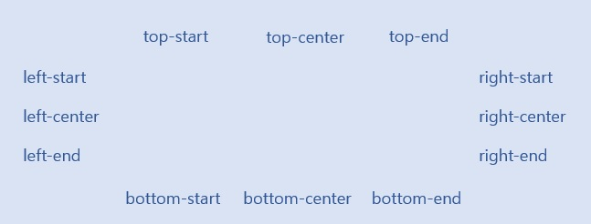

# seed-ui

웹 브라우저(chrome, Edge 등)를 사용하여 보시면 정리된 MD 문서 형식으로 보실 수 있습니다.

---

- [[1] 소개](#1-소개)
- [[2] 설치 및 의존성](#2-설치-및-의존성)
- [[3] 메뉴 객체 생성](#3-메뉴-객체-생성)
- [[4] Route 생성](#1-Route-생성)
- [[5] 헤더 생성](#5-헤더-생성)
- [[6] 사이드 메뉴 생성](#6-사이드-메뉴-생성)
- [[7] 버튼 생성](#7-버튼-생성)
- [[8] 툴팁 생성](#8-툴팁-생성)
- [[9] 모달 생성](#9-모달-생성)
- [[10] 알림창 생성](#10-알림창-생성)

## [1] 소개

웹사이트 제작에 공통적으로 필요한 템플릿 및 컴포넌트들을 제공하여 빠른 UI 구축할 수 있는 라이브러리 입니다.

## [2] 설치 및 의존성

> npm install seed-ui  
> yarn add seed-ui

| Dependency       | Version | Dependency      | Version |
| ---------------- | ------- | --------------- | ------- |
| react            | 18.2.0  | @emotion/react  | 11.9.3  |
| react-router-dom | 6.3.0   | @emotion/styled | 11.9.3  |
| lodash           | 18.2.0  |                 |         |

## [3] 메뉴 객체 생성

원하는 옵션으로 메뉴 객체를 생성합니다.  
해당 객체는 헤더와 사이드 메뉴 그리고 라우터를 생성할 때 필요합니다.

> - All : Header, Side Menu, SetRoute에서 사용
> - Required : 필수값
> - ETC : 작성된 곳에서 사용

1.  <code>title {String} (Required)</code>  
메뉴에 들어갈 메뉴 이름으로 Key 역할[unique]
<center>

</center>

2.  <code>link {String} (Header, Side Menu Option)</code>  
    메뉴 클릭 시 이동할 URL 주소

```javascript
<NavLink to={link} />
```

3.  <code>routePath {String} (Route Option)</code>  
    link에 따른 Route의 경로 설정  
    routePath가 없다면 link가 routePath로 설정

4.  <code>component {component} (Route Option)</code>  
    해당 Route에 보여줄 컴포넌트

```javascript
<Route path={routePath ? routePath : link} element={component} />
```

5.  <code>userRole {Integer} (All or Default = 권한 체크 안함.)</code>  
    해당 메뉴의 사용 권한을 체크하여 메뉴 활성/비활성(display:block/none) 판단  
    userRole(ulevel)이 menuRole보다 작다면 활성화

```javascript
userRole[1] > menuRole[3] >> 메뉴 활성화
userRole[3] > menuRole[1] >> 메뉴 비활성
```

6.  <code>subMenu {Array} (All)</code>  
    객체 배열 형태로 메뉴를 작성하면 재귀 함수로 해당 메뉴의 하위메뉴 및 하위 Route 생성

7.  <code>icon {component} (Side Menu Option)</code>  
    사이드 메뉴 사용 시 상위 메뉴의 아이콘 지정  
    (react-icons / svg 태그 사용)

```JavaScript
export const MenuList = [
	{
		title: '작업',
		link: 'work',
		component: <Work />,
		menuRole: 3,
	},
	{
		title: '프로젝트',
		link: 'project',
		component: <Project />,
		menuRole: 3,
	},
	{
		title: '설정',
		link: 'config',
		icon: <MdSettings />,
		menuRole: 1,
		subMenu: [
			{
				title: '작업 설정',
				link: '/config/work',
				routePath: 'work',
				component: <ConfigWork />,
				menuRole: 1,
				icon: <MdWork />,
			},
			{
				title: '테이블 동기화',
				link: '/config/sync',
				routePath: 'sync',
				icon: <MdSync />,
				subMenu: [
					{
						title: '테이블 설정',
						link: '/config/sync/table',
						routePath: 'work',
						component: <ConfigSyncTable />,
					},
					{
						title: '동기화 설정',
						link: '/config/sync/csync',
						routePath: 'csync',
						component: <ConfigSync />,
					},
				],
			},
			{
				title: '매크로',
				link: '/config/macro',
				routePath: 'macro',
				icon: <MdPanoramaPhotosphereSelect />,
				subMenu: [
					{
						title: '매크로 등록',
						link: '/config/macro/register',
						routePath: 'register',
						component: <MacroRegister />,
					},
					{
						title: '대시보드',
						link: '/config/macro/dashboard',
						routePath: 'dashboard',
						component: <MacroDashboard />,
					},
					{
						title: '명령어',
						link: '/config/macro/command',
						routePath: 'command',
						subMenu: [
							{
								title: '명령어 등록',
								link: '/config/macro/command/register',
								routePath: 'register',
								component: <MacroCommandRegister />,
							},
							{
								title: '명령어 설정',
								link: '/config/macro/command/setting',
								routePath: 'setting',
								component: <MacroCommandSetting />,
							},
							{
								title: '명령어 테스트',
								link: '/config/macro/command/test',
								routePath: 'test',
								component: <MacroCommandTest />,
							},
						],
					},
				],
			},
		],
	},
];
```

## [4] Route 생성

SetRoute를 이용해 메뉴의 Route를 생성

1. <code>MenuList {ObjectArray}</code>  
   Route를 구성할 객체 배열 [3] 메뉴 생성 참고

2. <code>UserRole {Integer}</code>  
   해당 메뉴의 사용 권한을 체크하여 Route 활성/비활성 판단

```javascript
function App() {
  return (
    <Router>
      <Routes>
        <Route path="/" element={<Index />}>
          {SetRoute(MenuList, 0)}
        </Route>
      </Routes>
    </Router>
  );
}
```

## [5] 헤더 생성

HeaderCreator로 Logo, TopMenu, Personal Menu 구성할 수 있습니다.

<div style="text-align: center;">
    
</div>

1. <code>logoSeeting {Object}</code>
   - <code>logo {String or Component}</code>  
     로고에 작성될 텍스트 또는 컴포넌트
   - <code>logoLink {String}(Default = "/")</code>  
     로고 클릭 시 이동할 URL 주소
   - <code>logoColor {String or HexColorCode}(Default = "#f1f4f5")</code>  
     로고의 값이 String일 때 fontColor 설정
2. <code>menuList {ObjectArray}</code>  
   Header에 생성될 메뉴 리스트 [3] 메뉴 생성 참고

3. <code>useDepth {Boolean} (Default : True)</code>  
   Header 메뉴의 DropDown 기능 사용 유무

4. <code>userRole {Int} (Default : 99)</code>  
   해당 메뉴의 사용 권한을 체크하여 메뉴 활성/비활성(display:block/none) 판단  
   userRole(ulevel)이 menuRole보다 작다면 활성화
   ```javascript
   userRole[1] > menuRole[3] >> 메뉴 활성화
   userRole[3] > menuRole[1] >> 메뉴 비활성
   ```

5<code>menuStyle {Object}</code>

- <code>headerColor {String or HexColorCode}</code>  
  Header Background-color
- <code>bgColor {String or HexColorCode}</code>  
  메뉴 Background-color
- <code>bgHoverColor {String or HexColorCode}</code>  
  메뉴 호버 시 변경 될 Background-color
- <code>fontColor {String or HexColorCode}</code>  
  메뉴 fontColor
- <code>size {Array}</code>  
  메뉴의 사이즈 [가로, 세로]
- <code>depthSize {Array}</code>  
  useDepth 사용(true) 시 나오는 하위 DropDown의 사이즈 [가로, 세로]
- <code>gap {Integer}</code>  
  Header 메뉴의 사이의 간격 수치

6<code>children {String or Component}</code>  
Header의 우측에 위치 할 Component

```javascript
function Index(props) {
  return (
    <>
      <HeaderCreator
        logoSetting={{
          logo: 'Seed UI Project',
          logoLink: '/',
          logoColor: '#eeeeee',
        }}
        menuList={DepthList1}
        useDepth={true}
        userRole={3}
        menuStyle={{
          headerColor: '#222831',
          bgColor: '#393E46',
          bgHoverColor: '#00ADB5',
          fontColor: '#EEEEEE',
          size: [5.5, 35],
          depthSize: [200, 40],
          gap: 20,
        }}
      >
        <NavLink to={'children'}>Children</NavLink>
      </HeaderCreator>
      <Outlet />
    </>
  );
}
```

## [6] 사이드 메뉴 생성

사이드 메뉴를 원하는 페이지를 AsideCreator로 감싸준다.  
최상단 컴포넌트에 사이드 메뉴를 생성하고 내부에 컴포넌트 작성 (children 이용하여 보여준다.)

1. <code>menuList {ObjectArray}</code> 사이드 메뉴에 생성될 메뉴 리스트 [2] 메뉴 생성 참고

2. <code>title {String}</code>  
   menuList에서 사이드 메뉴에 사용할 페이지의 최상단 메뉴 객체의 title 작성  
   해당 title로 현재 메뉴가 어떤 메뉴로 사이드 메뉴를 구성할 지 판단

<div style="text-align: center;">
    
</div>

```javascript
function SideMenuTest() {
  return (
    <AsideCreator menuList={menuList} title={'설정'}>
      Hello Work!@
    </AsideCreator>
  );
}
```

3. SideMenu Style 원하는 페이지에 사용이 될 SideMenu는 공통된 Style을 사용하기 위해 ThemeProvider 사용

- ThemeProvider(@emotion/react) 사용하여 사용할 프로젝트를 감싸준다.

```javascript
ReactDOM.createRoot(document.getElementById('root')).render(
  <React.StrictMode>
    <ThemeProvider theme={theme}>
      <App />
    </ThemeProvider>
  </React.StrictMode>,
);
```

- 원하는 Directory 내 theme.jsx 파일 생성
- asideMenuStyle 키로 지정하여 아래와 같이 Color 작성

```javascript
export const theme = {
  asideMenuStyle: {
    backgroundColor: '#222831', // 기본 Background color
    fontColor: '#EEEEEE', // 기본 Font Color
    hoverBackgroundColor: '#00ADB5', // hover 시 Background Color
    hoverFontColor: '#EEEEEE', // hover 시 Font Color
    divideLine: '#ebebeb', // 구분선 Color
  },
};
```

## [7] 버튼 생성

Button 컴포넌트를 이용해 원하는 옵션의 button 태그를 생성합니다.

1. <code>type {String}</code>

- 버튼의 형태
- "fill" : 배경색 존재 (default)
- "border" : 배경색 흰색, 테투리 존재
- "text" : 배경색 투명, 테두리 없이 텍스트만 존재

<div style="text-align: center;">
    
</div>

2. <code>color {String}</code>

- 버튼의 색깔
- "success" : 초록색
- "error" : 빨간색
- "coral" : 산호색
- "blue" : 파란색
- "gray" : 회색

<div style="text-align: center;">
    
</div>

3. <code>size {String}</code>

- 버튼의 크기
- "small" : 작은 크기
- "medium" : 중간 크기 (default)
- "big" : 큰 크기

<div style="text-align: center;">
    
</div>

4. <code>width {Number}</code>

- 버튼의 너비
- 버튼이 특정한 너비를 가져야 할 때 길이 지정 가능
- default 값은 auto

5. <code>disabled {Boolean}</code>

- 버튼 활성화 여부
- true : 버튼 활성화 (default)
- false : 버튼 비활성화

6. <code>isAnimation {Boolean}</code>

- 버튼 클릭시 애니메이션 동작 여부
- true : 애니메이션 동작 (default)
- false : 애니메이션 미동작

7. <code>icon {Component}</code>

- 아이콘 컴포넌트
- deafault 값은 <></>

<div style="text-align: center;">
    
</div>
<br/> 
 
8. 이벤트 및 텍스트, 기존 HTML 태그와 같은 방식으로 이용 가능

```javascript
function ButtonTest() {
  return <Button onClick={() => console.log('테스트 성공')}>테스트</Button>;
}
```

## [8] 툴팁 생성

Tooltip 컴포넌트를 통해, 텍스트에 마우스를 올릴 시 툴팁을 생성합니다.

1. <code>text {String}</code>

- 툴팁에 들어갈 텍스트
- default 값은 '텍스트를 넣어주세요.'

2. <code>position {String}</code>

- 툴팁의 위치
- default 값은 'top-center'

<div style="text-align: center;">
    
</div>

3. <code>bgColor {String}</code>

- 툴팁의 배경색
- default 값은 '#808080'

4. <code>fontColor {String}</code>

- 툴팁 텍스트의 색
- default 값은 'white'

5. <code>fontSize {String}</code>

- 툴팁 텍스트의 크기
- default 값은 '1rem'

예시

```javascript
function TestTooltip() {
  return <Tooltip text="표시될 툴팁">툴팁이 나와야할 텍스트</Tooltip>;
}
```

## [9] 모달생성

Modal 컴포넌트를 통해, 모달 창을 생성합니다.

1. <code>width {String} </code>

- 모달의 너비
- default 값은 '600px';

2. <code>height {String} </code>

- 모달의 높이
- default 값은 '600px';

3. <code>position {String} </code>

- 모달 생성 위치
- default 값은 'center'

<div style="text-align: center;">
    
</div>

4. <code>modalState {Boolean} </code>

- 모달 on, off 여부
- 상위 컴포넌트에서 useState 값 내려 받음
- default 값은 false

5. <code>handleClose {Function} </code>

- 모달을 닫는 (상태를 변경 하는 ) 함수
- 상위 컴포넌트에서 상태변경 기능이 포함된 함수를 내려 받음
- default 값은 null

6. <code>modalTitle {String} </code>

- 모달 제목
- default 값은 'undefined'로 ''로 표시됨

7. <code>isCloseBtn {Boolean} </code>

- 모달창 오른족 상단에 닫기 버튼 존재 여부
- default 값은 true

8. <code>resizable {Boolean} </code>

- 모달창 크기 조절 가능 여부
- default 값은 false

9. <code>movable {Boolean} </code>

- 모달창 상단을 드래그 하여 이동 가능한 지 여부
- default 값은 true

10. <code>buttonList {Component[]} </code>

- 모달창 하단에 표시될 버튼 목록
- default 값은 [ <Button size="small" color="blue" onClick={callback}> 확인 </Button>, <Button size="small" onClick={handleClose}>닫기</Button> ]

11. <code>callback {Function} </code>

- 모달창 확인 버튼을 눌렀을 시, 실행되는 함수
- default 값은 null

12. <code>style {Object} </code>

- 모달창 세부 스타일 지정
  - <code>headBg {String} </code>
    - 모달창 상단 배경 색상
    - default 값은 '#eee'
  - <code>headFc {String} </code>
    - 모달창 상단의 글씨, 아이콘의 색상
    - default 값은 '#808080'
  - <code>headBorder {String} </code>
    - 모달창 상단의 하단 테두리 스타일 지정
    - default 값은 'none'
  - <code>closeBtn {Component} </code>
    - 모달창 상단의 닫기 버튼에 들어갈 컴포넌트
    - default 값은 react-icons의 <AiOutlineClose />
  - <code>modalBorder {String} </code>
    - 모달창의 테두리 스타일 지정
    - default 값은 'none'
  - <code>isShadow {String} </code>
    - 모달창의 그림자 여부
    - default 값은 true

예시

```javascript
function TestModal() {
  const [isModalOpen, setIsModalOpen] = useState(false);

  const handleModal = useCallback(() => {
    setIsModalOpen(!isModalOpen);
  }, [setIsModalOpen, isModalOpen]);

  return (
    <>
      <button onClick={handleModal}>modalOpen</button>
      <Modal modalState={isModalOpen} handleClose={handleModal}>
        <div>modalContent</div>
      </Modal>
    </>
  );
}
```

## [10] 알림창 생성

alarm 함수를 사용하여 특정 상황에서 알림창을 생성합니다.

1. <code>name {String}</code>

- 안내 창의 성격
- 'success' (default)
- 'error'
- 'warning'
- 'info'
- 'answer'

2. <code>position {String}</code>

- 안내 창이 뜨는 위치
- 'left-start'
- 'left-center'
- 'left-end'
- 'center-start'
- 'center' (default)
- 'center-end'
- 'right-start'
- 'right-center'
- 'right-end'
<div style="text-align: center;">
    
</div>

3. <code>width {String}</code>

- 안내 창의 너비
- default 값은 '400px'

4. <code>height {String}</code>

- 안내 창의 높이
- default 값은 '100px

5. <code>timeLimit {Number}</code>

- 안내 창의 지속 시간
- default 값은 10000

6. <code>type {String}</code>

- 안내 창의 형태
- 'dark'
- 'light' (default)
- 'border'

7. <code>title {String}</code>

- 안내 창의 제목
- name === 'success'일 시, default 값은 성공
- name === 'error'일 시, default 값은 에러
- name === 'warning'일 시, default 값은 경고
- name === 'info'일 시, default 값은 안내
- name === 'answer'일 시, default 값은 확인

8. <code>text {String}</code>

- 안내 창의 상세 문구
- default 값은 '텍스트를 입력해주세요.'

9. <code>callback {Function}</code>

- (name === 'answer'일 때) 확인 버튼을 눌렀을 때 실행될 함수
- default 값은 null

10. <code>yBtnText {String}</code>

- (name === 'answer'일 때) 확인 버튼에 들어갈 텍스트
- default 값은 '확인'

11. <code>nBtnText {String}</code>

- (name === 'answer'일 때) 취소 버튼에 들어갈 텍스트
- default 값은 '취소'

예시

```javascript
function checkValid(input) {
  if (input.length < 8) {
    alert({ name: error, text: '8자 이상 입력해주세요.' });
  }
}
```
